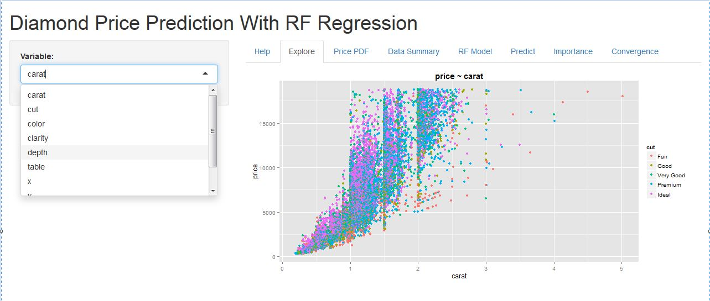

Predicting Diamond Prices
========================================================
author: Phanindra Reddigari
date: 8/16/2015

Objectives:
========================================================
Analyze the well known diamond dataset and develop a Shiny application for robust regression model for predicting diamond prices on test dataset. The UI is tab structured to provide user interaction to navigate the different analysis phases back and forth with relative ease:

- Tab1: Basic data exploration using ggplots of price vs other variables
- Tab2: User Documentation
- Tab3 and Tab4: Price density plots and data summary table
- Tab5: Summary of RF Regression (price ~ .) on training partition
- Tab6: Predict prices on test partition
- Tab7 and Tab8: Plots for documented RF Regression

UI Navigation Overview
========================================================


The UI screenshot demonstrates the user interaction aspects of the Shiny application 

RF Regression Outcome
========================================================

The UI tab designated RF Regression presents the overall results for RF Regression for diamond data set


```
  mtry      RMSE  Rsquared   RMSESD RsquaredSD
1    2 1093.2661 0.9341887 107.7058 0.01181468
2   12  887.4285 0.9481134 116.3227 0.01288844
3   23  900.0651 0.9465774 116.7550 0.01331971
```


Conclusions
========================================================
1. This application showcases a simple way for the user to navigate between basic phases of data analysis.

2. The RF Regression model is able to predict the diamond prices with fair amount of accuracy as evidenced by the RSquared value of 0.948 at the optimum values of 12 and 887.4 for mtry and RMSE, respectively.  

3. The variables of carat, y, x, z, and few factored levels of clarity and color are the most important variables, and others parameters are not significant to the regression model.
